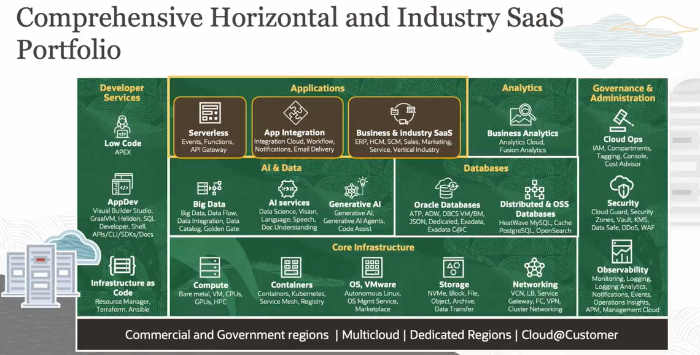
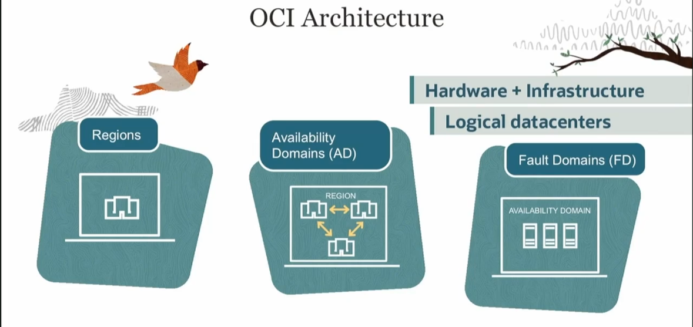
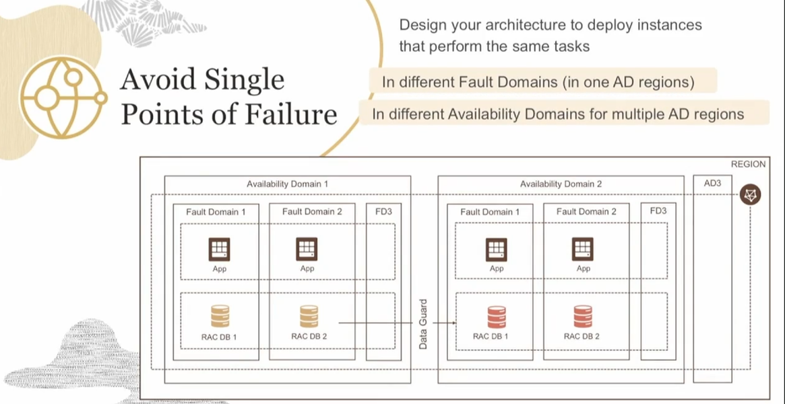
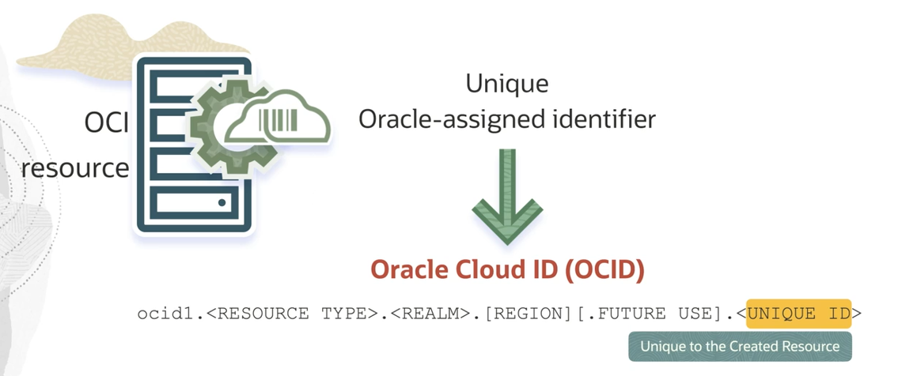
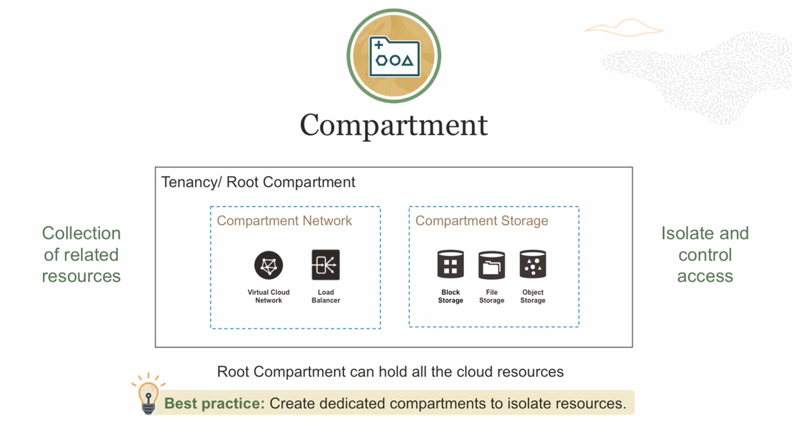
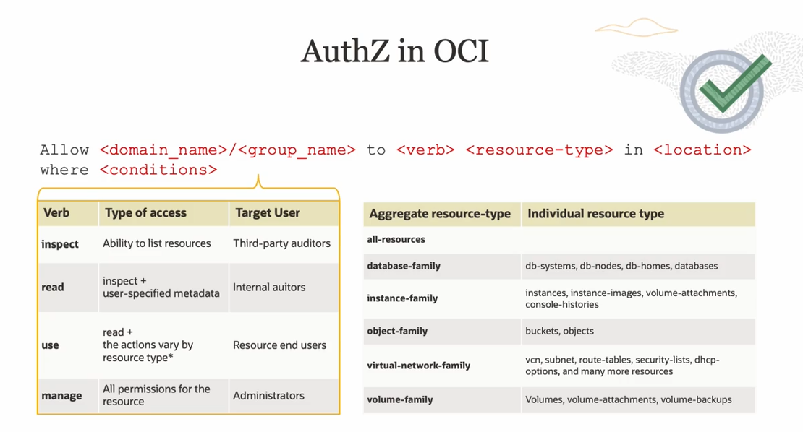
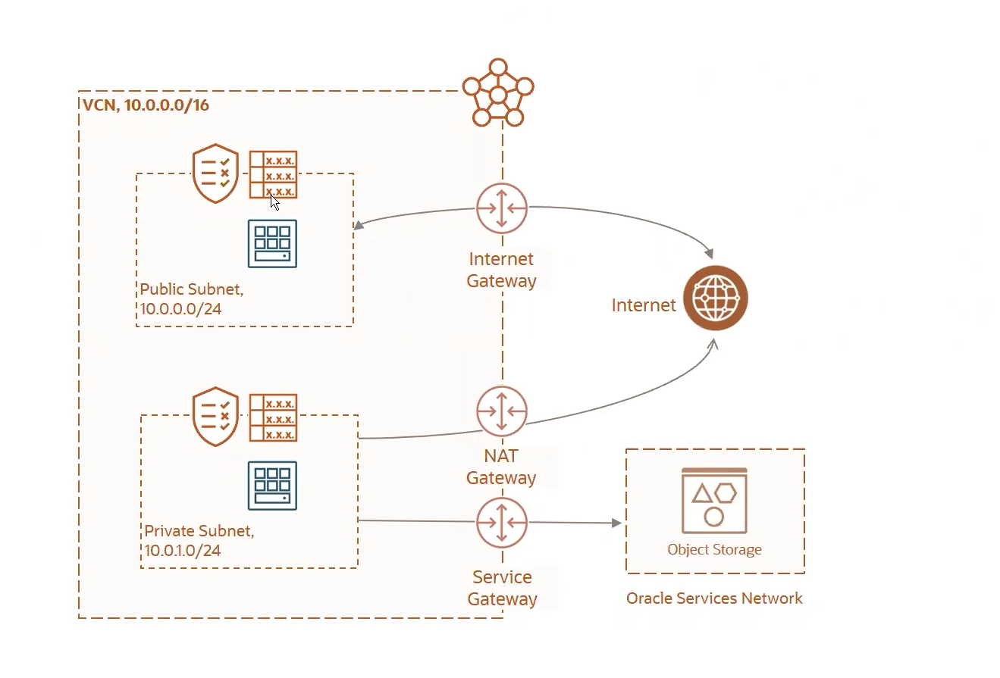
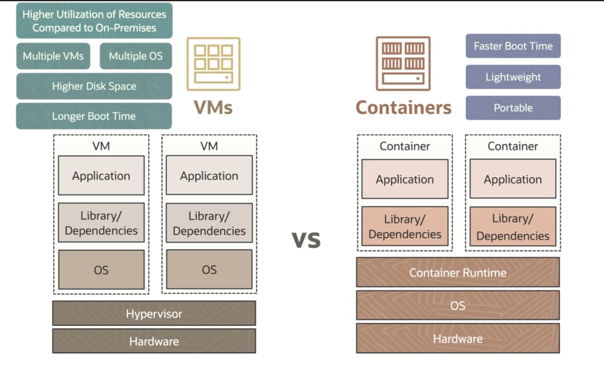
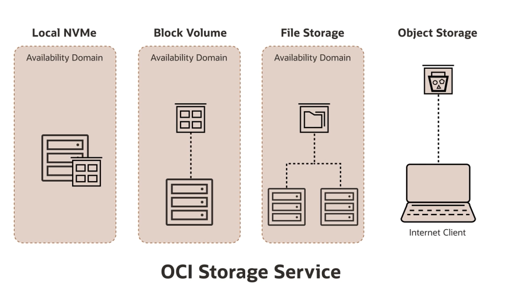
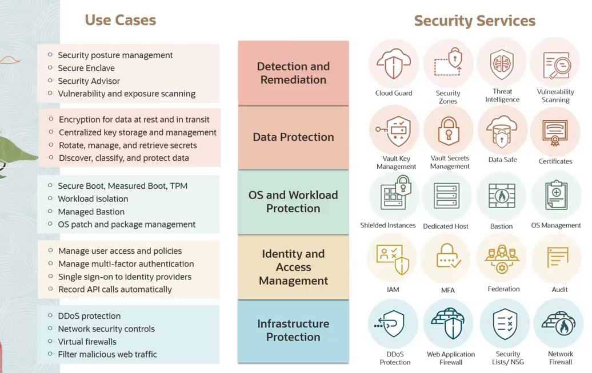

# Oracle Cloud Infrastructure Foundations – Resumo de Estudos

## 1. OCI Architecture

### 🌐 Conceitos Fundamentais

- **Tenancy** 🏢: Raiz lógica da sua presença na OCI (parecido com uma “organização”). Tudo — usuários, políticas, compartments e recursos — existe dentro dela.  
- **Region** 📍: Conjunto geograficamente isolado de infraestrutura (ex.: `sa-saopaulo-1`). Cada região é independente em energia, rede e capacidade.  
- **Availability Domain (AD)** 🏬🏬🏬: Data centers independentes dentro de uma região. Falha em um AD não impacta os outros → alta disponibilidade.  
- **Fault Domain (FD)** 🧩: Partições lógicas dentro de um AD (3 por AD). Distribuir instâncias entre FDs evita que manutenção ou falha de rack derrube todo o serviço.  

- **VCN (Virtual Cloud Network)** 🔗: Rede virtual isolada (CIDR escolhido) onde vivem subnets, roteamento e segurança.  
  - **Subnet Regional** 🌍: Vale para todos os ADs, simplifica failover.  
  - **Subnet AD-Local** 📦: Fixa recursos em um AD específico.  
- **Redundância / Alta Disponibilidade** ♻️: Replicar entre ADs/FDs ou usar serviços multi‑AD (Load Balancer, Autonomous DB).  
- **Disaster Recovery (DR)** 🚨: Replicação entre regiões (Object Storage Cross-Region, Block Volume Replication, Autonomous Data Guard).  
- **Edge Services** 🌍⚡: POPs para DNS, WAF, Email Delivery diminuem latência até o usuário final.  
- **Armazenamento** 💾: Object Storage (standard/archival), Block Volume (replicação automática entre FDs), File Storage (NFS), Archive.  
- **Observabilidade** 👁️: Logging, Monitoring, Events e Alarms para detectar e responder a incidentes.  
- **Rede e Segurança** 🔐: Route Tables, Security Lists, Network Security Groups, Internet/NAT/Service Gateways, Local/Remote Peering.  

### 📦 Sintaxe / Identificação dos Serviços OCI

#### OCIDs (Oracle Cloud IDs)
Cada recurso possui um identificador global único:  
`ocid1.<resource_type>.<realm>.<region>.<id>`  
Exemplo: `ocid1.instance.oc1.sa-saopaulo-1.abcd...`  
`<resource_type>` exemplos: `instance`, `subnet`, `vcn`, `bucket`, `autonomousdatabase`, `user`, `compartment`.

#### Tipos Agregados (Resource Families)
Usados para simplificar políticas de autorização:

| Família (`*-family`) | Abrange |
|----------------------|--------|
| `instance-family` | Instâncias, boot volumes, attach/detach |
| `volume-family` | Block Volumes e backups |
| `object-family` | Buckets e objetos (Object Storage) |
| `database-family` | DB Systems, Autonomous Databases |
| `virtual-network-family` | VCN, subnets, route tables, gateways |
| `functions-family` | Oracle Functions |
| `management-dashboard-family` | Dashboards de observabilidade |
| `logs-family` | Logging |
| `keys-family` | Vault Keys |
| `all-resources` | Todos os recursos (usar só para admins) |

(Existem outras famílias específicas, mas estas são as principais.)

#### Tipos de Acesso (Verbos / Ações)
Hierarquia – cada nível inclui os anteriores:  
`inspect < read < use < manage`

- **inspect**: Listar metadados (nomes, OCIDs) – sem conteúdo.  
- **read**: `inspect` + ler conteúdo (ex.: baixar objeto).  
- **use**: `read` + executar operações funcionais (start/stop instância, gerar tokens).  
- **manage**: Controle total (criar, atualizar, deletar, alterar políticas internas).  

Também existem permissões específicas usadas em condições ou instruções finas (ex.: `read keys`, `use buckets`, `manage object-family`).

### 🔑 Sintaxe de Policies (AuthZ)

Estrutura básica (uma linha por instrução):  
`Allow <principal-type> <principal-name> to <verb> <resource-type|family> in <scope> [where <conditions>]`

Componentes:
- **principal-type**: `group` | `dynamic-group` | `service`
- **principal-name**: nome do grupo/dynamic group
- **verb**: `inspect|read|use|manage` ou ação específica
- **resource-type|family**: `instance-family`, `buckets`, `all-resources` etc.
- **scope**: `tenancy` ou `compartment <nome|ocid>`
- **conditions (opcional)**: filtros com tags ou atributos

Exemplos de policies:
Allow group Admins to manage all-resources in tenancy
Allow group Devs to use instance-family in compartment Dev
Allow dynamic-group BatchInstances to use object-family in compartment Shared where any { request.permission='OBJECT_CREATE' }
Allow group Auditors to read audit-events in tenancy

Condições comuns:
- `request.permission = '<permissão>'`
- `target.compartment.id = 'ocid1.compartment...'`
- `target.resource.tag.<namespace>.<key> = 'valor'`

### 🧩 Comparação com Concorrentes
| Conceito OCI | AWS | Azure | GCP |
|--------------|-----|-------|-----|
| Tenancy 🏢 | Account | Subscription | Project |
| Region 📍 | Region | Region | Region |
| Availability Domain 🏬 | Availability Zone | Availability Zone | Zone |
| Fault Domain 🧩 | (Partition Placement) | Fault Domain | (Distribuir entre Zones) |
| Compartments 📂 | Accounts/OUs + Tags | Resource Groups | Folders/Projects |
| VCN 🔗 | VPC | VNet | VPC |
| Service Gateway 🛰️ | VPC Endpoint / PrivateLink | Private Link / Service Endpoint | Private Service Connect |
| Cross-Region DR 🚨 | S3 CRR / RDS Replicas | GRS Storage / Geo-Rep | Multi-/Dual-Region Storage |
| Edge DNS/WAF 🌍 | Route53 / CloudFront WAF | Azure DNS / Front Door | Cloud DNS / Cloud Armor |

---

## 2. Identity and Access Management (IAM)

### 🔐 IAM Introduction
Gerencia identidades (usuários, grupos, recursos) e permissões via policies legíveis. Integração com federação SAML/OAuth, MFA e identidades gerenciadas (Instance/Resource Principals).

### 📂 Compartments & 🪪 Identity Domains

- **Compartments**: Hierarquia lógica para isolar recursos, delegar administração e facilitar billing/auditoria.  
- **Identity Domains**: Domínios de identidade independentes com usuários, grupos, provedores de autenticação, políticas de senha e MFA. Permitem separar identidades internas/externas.

### ✅ AuthN (Autenticação) & 🔓 AuthZ (Autorização)
**AuthN**: Verifica identidade. Métodos: senha + MFA, API Keys, Auth Tokens, Federation (SAML/OAuth), Instance Principals (VMs), Resource Principals (Functions/OKE), tokens de sessão.

**AuthZ**: Concedida por policies (sintaxe acima). Boas práticas:

- Princípio do menor privilégio (`use` em vez de `manage` quando possível).
- Usar families (`instance-family`, `object-family`) reduz manutenção.
- Dynamic Groups: agrupam recursos por condições (ex.: tag ou compartment).  
  Exemplo de regra de dynamic group:  
  `ANY {instance.compartment.id = 'ocid1.compartment....'}`  
  Policy correspondente:  
  `Allow dynamic-group OKEPods to use object-family in compartment Dev`
- Condições refinam acesso (permissão específica ou tag exigida).

### 🏗️ Tenancy Setup (Passo a Passo)
1. Estrutura de compartments.  
2. Identity Domains / Federação.  
3. Grupos e Dynamic Groups.  
4. Policies (menor privilégio).  
5. MFA e rotação de chaves.  
6. Auditoria habilitada (Audit/Logging).  
7. Automatização com Instance/Resource Principals.  

### 🤝 Comparação (IAM)
| Recurso OCI | AWS | Azure | GCP |
|-------------|-----|-------|-----|
| Policies 📜 | IAM Policy JSON | RBAC Role Assignment | IAM Bindings |
| Dynamic Groups 🧠 | IAM Conditions + Tags | Dynamic Groups | IAM Conditions |
| Instance Principals 🖥️ | EC2 Instance Role | Managed Identity | Service Account |
| Resource Principals ⚙️ | Lambda Execution Role | Managed Identity | Service Account |
| Compartments 📂 | Accounts/OUs/Tags | Resource Groups | Folders/Projects |
| MFA 🔐 | MFA | MFA/Conditional Access | MFA |
| Audit Logs 🕵️ | CloudTrail | Activity Log | Cloud Audit Logs |

## Networking

### 3.1 🔗 VCN Introduction
- **O que é**: Virtual Cloud Network (VCN) é sua rede virtual privada na OCI, completamente isolada e configurável (CIDR, subnets, roteamento).  
- **Componentes principais**:  
  - **CIDR block** (ex.: `10.0.0.0/16`)  
  - **Subnets** (regionais ou AD-local)  
  - **Route Tables**  
  - **Security Lists / Network Security Groups**  
  - **Gateways** (Internet, NAT, Service, DRG)  
- **Caso de uso**: Criar Zonas de DMZ, redes de front-end/back-end isoladas, interligar data centers on-premises.  

| OCI (VCN)           | AWS (VPC)         | Azure (VNet)      | GCP (VPC)        |
|---------------------|-------------------|-------------------|------------------|
| Rede global regional| Regional/global   | Regional          | Regional/global |
| Subnets regionais   | Subnets AZ        | Subnets Region/​AZ| Subnets Global  |
| Gateways nativos    | IGW, NAT, VGW     | Internet/NAT GW   | IGW, Cloud NAT  |

---

### 3.2 ➡️ VCN Routing
- **Route Tables**: definem para onde o tráfego sai da subnet.  
- **Tipos de rota**:  
  - `0.0.0.0/0` → Internet Gateway (tráfego público)  
  - `10.0.0.0/16` → Local (intra-VCN)  
  - `Service CIDR` → Service Gateway (p. ex., Object Storage)  
  - `DRG Attachment` → Dynamic Routing Gateway (VPN/DR)  
- **Propagação**: rotas estáticas configuradas manualmente; rota dinâmica via DRG opcional.  

| OCI (Route Tables)    | AWS (Route Tables)       | Azure (User Routes)         | GCP (Custom Routes)      |
|-----------------------|--------------------------|-----------------------------|--------------------------|
| Estático + DRG        | Estático + VGW BGP       | Estático + BGP ExpressRoute| Estático + Cloud Router |

---

### 3.3 🔐 VCN Security
- **Security Lists**: firewall em nível de subnet (stateless).  
- **Network Security Groups (NSG)**: firewall em nível de instância (stateful).  
- **Ingress/Egress Rules**: portas, protocolos, CIDRs.  
- **Private vs Public**:  
  - **Public Subnet** com Internet Gateway + regras abertas (somente o necessário).  
  - **Private Subnet** com NAT Gateway para saída sem entrada direta.  
- **Opcional**: Web Application Firewall (WAF) via Load Balancer; IPS através de parceiros no Marketplace.  

| OCI                   | AWS                      | Azure                         | GCP                         |
|-----------------------|--------------------------|-------------------------------|-----------------------------|
| Security Lists (SL)   | Network ACLs (stateless) | NSGs (stateful) + ASGs        | Firewall Rules (stateful)   |
| NSG (stateful)        | Security Groups          | Network Security Groups       | Firewall with Tags/Service  |
| WAF no LB             | AWS WAF + ALB/CLB        | WAF no Application Gateway    | Cloud Armor + LB           |

---

### 3.4 ⚖️ Load Balancer
- **Tipos**:  
  - **Public Load Balancer** (pública)  
  - **Private Load Balancer** (intra-VCN)  
  - **Opcional**: Network Load Balancer (L4) vs Application Load Balancer (L7) via partners.  
- **Componentes**:  
  - **Listener** (porta/protocolo)  
  - **Backend Set** (pool de instâncias ou IPs)  
  - **Health Checks** (HTTP, TCP)  
  - **SSL Offload** (certificados gerenciados)  
- **Use cases**: escalabilidade, alta disponibilidade, SSL termination, path-based routing.  

| OCI LB                 | AWS ELB                       | Azure Load Balancer / App GW | GCP Cloud Load Balancing     |
|------------------------|-------------------------------|------------------------------|------------------------------|
| Public / Private LB    | ALB / NLB / CLB               | Public LB / Internal LB      | HTTP(S) LB / TCP/UDP LB     |
| SSL offload integrada  | ACM + ELB                     | Managed Certificates         | Managed SSL Certs           |
| Health Checks nativos  | Health Checks definíveis      | Health Probes                | Health Checks               |

## Capítulo 4: Compute

### 4.1 Compute Introduction  
A família **Compute** da OCI oferece máquinas virtuais (VMs) elásticas e de alta performance para executar cargas de trabalho variadas — desde servidores web e bancos de dados até aplicações de inteligência artificial.  
- 🖥️ **VMs gerenciadas**: Templates imutáveis, alta disponibilidade e integração nativa com Block Storage, Networking e IAM.  
- ⚙️ **Shapes**: Configurações pré-definidas ou flexíveis de OCPU e memória, otimizadas para CPU-intensivo, memória-intensivo ou uso geral.  
- 🔄 **Integrado** com Auto Scaling, Compartments e Observability (Monitoring/Logging) para operações DevOps/SRE.  

### 4.2 Instance Basics  

- **Image & Boot Volume**  
  - Escolha de **imagem** (Oracle Linux, Ubuntu, Windows, custom) que define o SO e pacotes iniciais.  
  - **Boot Volume** persistente (Block Volume) que armazena SO e dados. Pode ser copiado, ampliado e replicado.  
- **Shapes**  
  - **Standard Shapes** (VM.Standard2.x, VM.Standard.E3.x): balanceados.  
  - **Dense I/O** (VM.DenseIO2.x): I/O intensivo.  
  - **GPU Shapes** (BM.GPU2.1): para ML e render.  
  - **Flex Shapes** (VM.Standard.E4.Flex): defina OCPUs/memória custom.  
- **Networking**  
  - Associação a uma **VCN + Subnet**: pública (Internet Gateway) ou privada (NAT).  
  - Configuração de **public IP**, **private IP** e **secondary VNICs**.  
- **Chaves SSH / Auth**  
  - Injeção de chave pública no momento do launch.  
  - Suporte a Instance Principals para automação sem credenciais.

### 4.3 Demo: Creating a Compute Instance  
1. **Console → Compute → Instances → Create Instance**  
2. **Define** nome, availability domain e compartment.  
3. **Escolher Image & Shape** (ex.: Oracle Linux 8 + VM.Standard2.1).  
4. **Configurar Networking**: VCN, subnet, atribuir Public IP.  
5. **Chave SSH**: colar key pública do cliente.  
6. **Avançar**: Tags, Metadata, Boot Volume size.  
7. **Create** → Instância provisionada em segundos.  
8. **Acessar via SSH** (`ssh opc@<public_ip>`), validar SO e montar Block Volumes adicionais.  

### 4.4 Scaling  
- **Vertical Scaling**  
  - **Resize** de shape (scale-up/down): requer shutdown ou live migration em determinados cases.  
  - Ajustar OCPU/memória sem reprovisionar disco.  
- **Horizontal Scaling**  
  - **Instance Pools** + **Autoscaling**:  
    - Cria grupo de instâncias idênticas (baseado em launch configuration).  
    - Regras de autoscale (CPU, Memory, Custom Metrics) que adicionam/removem instâncias automaticamente.  
- **Load Balancer Integration**: espalhar tráfego entre instâncias de um pool, garantindo alta disponibilidade.

### 4.5 Oracle Container Engine for Kubernetes (OKE)  

- **OKE** é o serviço gerenciado de Kubernetes da OCI:  
  - **Clusters** control plane redundante e upgrade automático.  
  - **Node Pools**: grupos de VMs gerenciados, usando shapes otimizados para pods.  
  - **Auto Repair & Auto Scaling** de nós.  

- **Integrações**:  
  - **IAM & RBAC** nativo;  
  - **VCN CNI** (cada pod recebe IP na VCN);  
  - **Service Mesh** (OCI Service Mesh) para observabilidade e segurança no tráfego entre microservices.  
- **Fluxo**:  
  1. Criar cluster OKE  
  2. Provisionar node pool  
  3. `kubectl` & `helm` deploy de workloads  
  4. Monitorar com OCI Monitoring / Prometheus  

### 4.6 Container workloads in OCI  
- **Container Instances** (Container Engine Light):  
  - Executar containers isolados sem gerenciar VMs ou Kubernetes.  
  - Ideal para jobs event-driven.  
- **Registry**: Oracle Container Registry (OCIR) ou Docker Hub integrado.  
- **DevOps Integration**: build/push automático de imagens via Code Repository + Pipelines.  
- **Networking**: containers recebem VNICs ou compartilham da VM hospedeira, com Security Lists/NSGs aplicados.

### 4.7 Serverless with Oracle Functions  
- **Oracle Functions** é uma plataforma FaaS baseada no projeto Fn:  
  - **Functions**: unidades leves de código (Java, Python, Go, Node.js, etc.).  
  - **Applications**: coleções de funções que compartilham configurações e VCN.  
  - **Triggers**: eventos que disparam funções — HTTP (API Gateway), Streaming, Object Storage, Vault.  
- **Escalonamento automático** e **cobrança por invocação**: sem gestão de infraestrutura.  
- **CLI & SDK**: `fn init`, `fn deploy`, integração com Terraform e Cloud Events.  
- **Casos de uso**: processamento de eventos, back-ends leves, orquestração de pipelines sem servidor.

---

## Capítulo 5: Storage

### 5.1 Storage Introduction  
A OCI oferece quatro modelos principais de armazenamento para atender desde dados transitórios de alta velocidade até arquivos “friamente” acessados:

- 🛠️ **Local NVMe (Ephemeral)**  
- 📦 **Block Volume (Persistente)**  
- 📂 **File Storage (Sistema de Arquivos Compartilhado)**  
- ☁️ **Object Storage (Armazenamento de Objetos)**  

Cada tipo tem características únicas de performance, durabilidade, persistência e integração com Compute/Networking.

---

### 5.2 Local NVMe (Ephemeral)  
- **O que é**: SSDs NVMe locais conectados diretamente ao host da instância.  
- **Disponível em**: Dense I/O Shapes e em alguns Bare Metal Shapes.  
- **Características**:  
  - **Altíssima IOPS/Throughput** (até centenas de milhares de IOPS).  
  - **Baixa latência** (< 1 ms).  
  - **Ephemeral**: dados são perdidos quando a instância é terminada ou reiniciada.  
- **Use cases**:  
  - Cache de banco de dados in-memory (Redis, Cassandra).  
  - Processamento de logs/temp files de alta velocidade.  
  - Workloads HPC sensíveis à latência de I/O.  

---

### 5.3 Object Storage  
Armazenamento de objetos via HTTP/HTTPS, ideal para dados não estruturados (imagens, vídeos, backups, logs).

#### 🎚️ Tiers e Diferenças  
- **Standard**  
  - Alta disponibilidade (3 cópias em múltiplos Fault Domains).  
  - Latência de leitura/gravação otimizada.  
  - Uso geral (site assets, streaming, CDN).  
- **Infrequent Access**  
  - Custo de armazenamento ~40 % menor que Standard.  
  - Latência similar, porém custo de GET/PUT um pouco mais alto.  
  - Ideal para archives de curto prazo, logs antigos, backups lidos ocasionalmente.  
- **Archive**  
  - Custo de armazenamento ~80 % menor que Standard.  
  - Objetos precisam ser restaurados (1–12 horas) antes de leitura.  
  - Para long-term retention de compliance e backups frios.  

#### 🔄 Mudança de Tier (Lifecycle Policies)  
- Defina políticas no bucket para migrar objetos automaticamente entre tiers após X dias de inatividade.  
- Ex.: mover arquivos de log de Standard → Infrequent Access após 30 dias; → Archive após 180 dias.  

#### 🔐 Criptografia de Dados  
- **SSE-OCI** (server-side encryption) automática com chaves gerenciadas pela OCI.  
- **SSE-KMS** opcional: use chaves do Vault.  
- **Client-Side Encryption**: criptografar antes de enviar, mantendo o servidor agnóstico.  
- **In Transit**: comunicação sempre via TLS/SSL.  

#### 🔧 Recursos Adicionais  
- **Versioning**: manter versões antigas de objetos.  
- **Replication**: Cross-Region Replication para duplicar buckets em outra região.  
- **Pre-Signed URLs**: acesso temporário controlado.  

---

### 5.4 Block Volume  
Volumes em rede persistentes entregues via iSCSI, montados em instâncias Compute.

#### 🚦 Tiers de Performance  
| Tier                      | IOPS/TB                | Latência      | Use Case                          |
|---------------------------|------------------------|---------------|------------------------------------|
| **Lower Cost**            | 120–1 800              | ~2 ms         | Desenvolvimento, teste, dev       |
| **Balanced**              | 600–12 000             | ~1 ms         | Bancos de dados gerais, apps      |
| **Higher Performance**    | 2 400–48 000           | ~0,7 ms       | OLTP intensivo, analytics em tempo real |
| **Ultra-High Performance**| até 1 000 000+         | < 0,5 ms      | Big Data, ML training, HPC        |

#### 🔄 Resizing  
- **Expandir**: aumentar size no Console/CLI e estender o filesystem dentro da VM sem downtime.  
- **Reduzir**: não suportado diretamente; fluxo envolve snapshot, criar volume menor e restore.

#### 🔐 Criptografia  
- **At Rest**: SSE-OCI por padrão.  
- **Customer-Managed Keys**: escolha chaves do Vault por volume.  
- **In Transit**: tráfego iSCSI cifrado TLS opcional.

#### 🔄 Backups & Snapshots  
- **Volume Backups**: full/incremental, agendados, armazenados em Object Storage.  
- **Restore**: criar novo volume a partir de backup em segundos.

### 5.5 File Storage  
Sistema de arquivos NFS montável por múltiplas instâncias simultaneamente.

- **Configuração**  
  - Crie um File System e Mount Target em subnets públicas/privadas.  
  - Defina Export Options (IP/CIDR, NFSv3/v4, squash).  
- **Performance & Throughput**  
  - **Baseline**: 2 GiB/s throughput, 30 K IOPS por TiB.  
  - **Scale Out**: largura de banda aumenta conforme cresce o volume ou a carga.  
- **Use Cases**  
  - Home directories, configurações compartilhadas, aplicações legadas.  
  - Workloads que exigem POSIX semantics e bloqueios de arquivo.  
- **Durability & Backups**  
  - Snapshots instantâneos do File System.  
  - Clonagem copy-on-write para testes sem consumir espaço extra.  

---

## Capítulo 6: Security

### 6.1 Detection and Remediation  
- **Use Cases**:  
  - Security posture management e contínua avaliação de conformidade.  
  - Secure Enclave (execução de workloads sensíveis em hardware isolado).  
  - Security Advisor: recomendações de hardening e correções.  
  - Vulnerability & Exposure Scanning para identificar gaps em VMs, containers e imagens.  
- **Serviços OCI**:  
  - **Cloud Guard** 🛡️: consolida sinais de segurança, detecta anomalias e aciona remediações automáticas.  
  - **Security Zones** 🚧: impede provisão de recursos fora das políticas de segurança definidas.  
  - **Threat Intelligence** 🔍: insights de ameaças globais e indicadores de compromisso (IOCs).  
  - **Vulnerability Scanning** 🔎: scanner de imagens e sistemas de arquivos para CVEs.

### 6.2 Data Protection  
- **Use Cases**:  
  - Criptografia de dados at rest e in transit.  
  - Centralização de chaves e gerenciamento de segredos.  
  - Discover, classify e monitoramento de dados sensíveis.  
- **Serviços OCI**:  
  - **Vault Key Management** 🔑: gerenciamento de chaves mestras (CMKs), rotação e políticas de acesso.  
  - **Vault Secrets Management** 📜: armazenamento seguro de senhas, tokens e certificados.  
  - **Data Safe** 🛡️: avaliação contínua de segurança de bancos Autonomous/DB Systems, mascaramento e auditoria.  
  - **Certificates** 📄: emissão e gestão de TLS/SSL para Load Balancers, API Gateway, etc.

### 6.3 OS and Workload Protection  
- **Use Cases**:  
  - Secure Boot, Measured Boot e TPM para garantir integridade do firmware/bootloader.  
  - Isolamento de workload (bare metal vs VM vs container).  
  - Managed Bastion para acesso seguro a redes privadas.  
  - Patching e gestão de pacotes do SO.  
- **Serviços OCI**:  
  - **Shielded Instances** 🛡️: VMs que verificam integridade em todas as camadas de boot.  
  - **Dedicated Host** 🖥️: isolamento físico de hardware para compliance/licenciamento.  
  - **Bastion** 🔐: jump host gerenciado, sem SSH direto na internet.  
  - **OS Management** 📦: gestão de patches, updates e inventário de pacotes.

### 6.4 Identity and Access Management  
- **Use Cases**:  
  - Gerenciar acesso de usuários, grupos e políticas de forma centralizada.  
  - MFA e Single Sign-On (SSO) via provedores de identidade externos.  
  - Registro automático de chamadas API para auditoria e compliance.  
- **Serviços OCI**:  
  - **IAM** 👤: usuários, grupos, compartments, policies (inspect/read/use/manage).  
  - **MFA** 🔒: autenticação multifator (TOTP, SMS, hardware token).  
  - **Federation** 🌐: SAML/OIDC com Azure AD, Okta, etc.  
  - **Audit** 🕵️: logging imutável de todas as chamadas de API da OCI.

### 6.5 Infrastructure Protection  
- **Use Cases**:  
  - Proteção contra ataques DDoS em camadas de rede e aplicação.  
  - Controles de segurança de rede: firewalls virtuais, listas de segurança e grupos de segurança.  
  - Filtragem de tráfego malicioso em borda e VCN.  
- **Serviços OCI**:  
  - **DDoS Protection** ⚔️: mitigação automática em escala global.  
  - **Web Application Firewall (WAF)** 🕸️: regras predefinidas e customizadas para proteger HTTP/S.  
  - **Security Lists / NSG** 🔐: ACLs stateless em subnets e stateful em VNICs.  
  - **Network Firewall** 🔥: appliance virtual gerenciado para inspeção profunda de pacotes.  

## Capítulo 7: Governance and Administration

### 7.1 Pricing  
A OCI adota modelos de precificação flexíveis por recurso e região.  
- **On-Demand**: cobra por OCPU-hora e GB-mês de armazenamento, sem compromisso mínimo.  
- **Discounted Models**:  
  - **Reserved Capacity Commitments** (1-3 anos) com desconto de até 45 %.  
  - **Sustained Use Discounts**: aplica desconto automático conforme uso contínuo de OCPUs.  
- **Preemptible / Spot (Preemptible Instances)**: até 70 % off, com possibilidade de interrupção.  
- **Bare Metal Pricing**: preço por hora para shapes BM.*, sem hypervisor.  
- **Região & Shape Variabilidade**: custos variam conforme região (latência, demanda) e família de shape (Standard, Dense I/O, GPU).  
- **Pricing Calculator**: simule custos por serviço, shape e região, ajuste configurações antes de provisionar.

---

### 7.2 Cost Management  
Ferramentas para análise e otimização de gastos:  
- **Cost Analysis**  
  - Dashboards por compartment, tag ou serviço.  
  - Gráficos de tendência, top spenders e forecast.  
- **Cost Reports**  
  - Relatórios agendados (CSV/PDF) entregues por e-mail.  
  - Cost Allocation Reports detalhando uso e custos por unidade de negócio.  
- **Cost Categories**  
  - Agrupe custos personalizados (ex.: “Desenvolvimento”, “Produção”).  
  - Aplique regras para mapear contas/compartments às categorias.  
- **Recommendations**  
  - Idle Resources: detecta instâncias não utilizadas.  
  - Under-utilized Volumes e Load Balancers: sugere rightsizing ou desligamento.

---

### 7.3 Billing & Payment Methods  
Processo de faturamento e cobrança:  
- **Fatura Mensal**: consolidada por tenancy, detalha serviços, regiões e impostos.  
- **Payment Instrument**  
  - Cartão de crédito ou débito direto.  
  - Billing Account com múltiplos tenancies vinculados.  
- **Currency & Tax**  
  - Multimoeda (BRL, USD, EUR).  
  - Configuração de impostos (IVA, ISS) de acordo com país.  
- **Invoice Delivery**  
  - E-mail automático para usuários designados.  
  - Portal OCI para download histórico de faturas.

---

### 7.4 Budgets & Alerts  
Controle pró-ativo de custos via orçamentos e notificações:  
- **Budgets**  
  - Defina orçamento por compartment ou tag (ex.: R$ 10 000/mês para “Projetos Mobile”).  
  - Escolha período (mensal, trimestral, anual).  
- **Alerts**  
  - Gatêros em % de consumo (50 %, 75 %, 90 %, etc.).  
  - Entrega via e-mail, SMS ou integração com Notifications/Streaming.  
- **Actions Automáticas**  
  - Invocar Functions ou Autonomous Database quando ultrapassar threshold.  
  - Desligar recursos não críticos via Automation.

---

### 7.5 Tagging  
Padronização para governança, segurança e billing:  
- **Defined Tags**  
  - Namespace + Tag Key + Valor predefinidos.  
  - Ex.: `CostCenter.Dept = “TI”`, `Environment.Stage = “Prod”`.  
- **Free-Form Tags**  
  - Chave/valor flexível sem governo centralizado.  
- **Tag Inheritance**  
  - Recursos herdam tags do compartment pai ou do resource group.  
- **Uso em Cost Management**  
  - Filtrar Cost Analysis por tag.  
  - Gerar relatórios de custo por projeto, time ou aplicação.  
- **Governança**  
  - Policies bloqueiam criação de recursos sem tags obrigatórias.  
  - Audit verifica conformidade de tagging.

---

### 7.6 Support Rewards  
Programas para reduzir custos e obter benefícios extras:  
- **Free Tier**  
  - **Always Free**: VMs, Block Volumes, Object Storage, Autonomous Database com quotas gratuitas permanentes.  
  - **30-Day Trial**: $300 USD em créditos para testar serviços pagos.  
- **Oracle Cloud Rewards**  
  - Créditos por participação em eventos, treinamentos e hackathons.  
  - Indique colegas para ganhar créditos adicionais.  
- **Support Plans**  
  - **Basic (Grátis)**: acesso ao fórum, documentação e tickets de faturamento.  
  - **Bronze/Silver/Gold/Platinum**: níveis pagos com SLAs de 4 h a 15 min, suporte 24×7, white-glove onboarding.  
- **Uso de Créditos**  
  - Aplique créditos de trial e rewards para abater faturas.  
  - Monitore saldo e expiração no portal de Billing.

---
